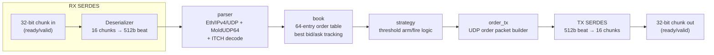
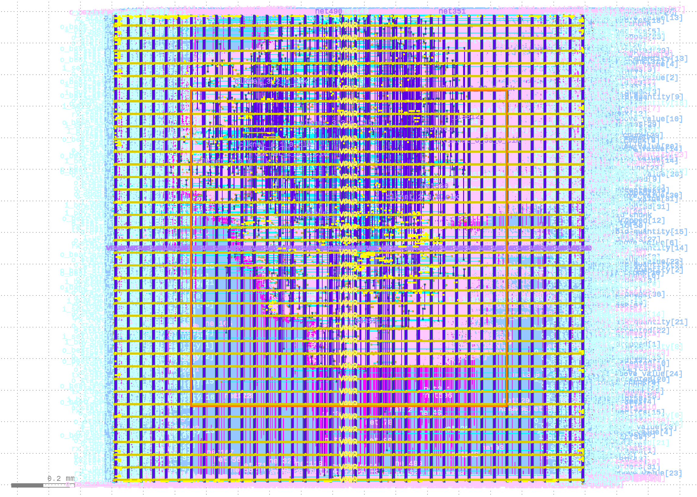
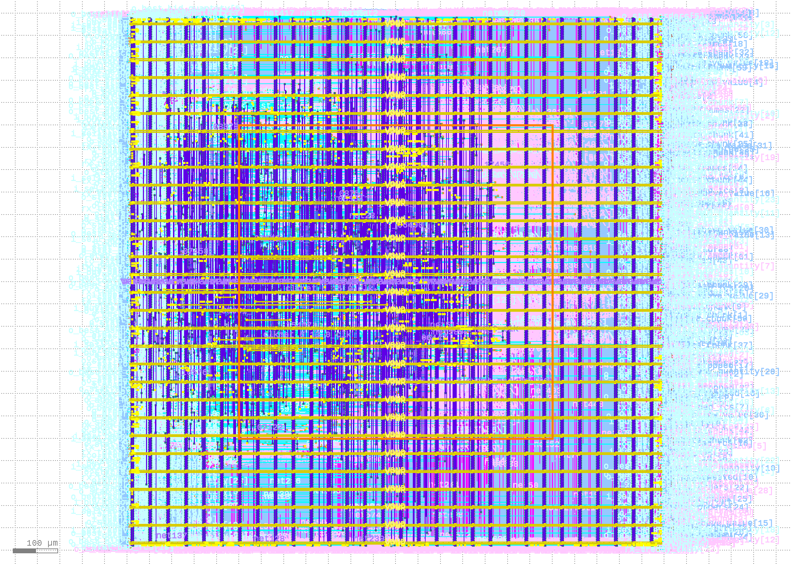

# HFT Pipeline (ASIC)

A pipelined RTL design that parses a market data feed, maintains a best-bid/offer
order book, applies a simple threshold trading strategy, and emits outbound order
packets — hardened to silicon on the open-source SkyWater 130nm PDK via OpenLane.

> This is a personal/educational RTL + ASIC-flow project. It is not connected to
> any real exchange or trading system — network addressing, magic numbers, and
> the market data protocol subset are simplified for simulation purposes.

---

## Overview

The design decodes an Ethernet/IPv4/UDP-framed, MoldUDP64-encapsulated ITCH-style
market data feed one 512-bit beat at a time, updates a per-instrument limit order
book, evaluates a configurable threshold strategy, and — when triggered — builds
and transmits a UDP "order" packet. Everything downstream of the input beat is a
straight-through pipeline: no stalls, no retries, one shot at the data as it goes by.



## Module Summary

| Module | Role | Notes |
|---|---|---|
| `hft_top` | Top-level integration + I/O SERDES | Converts the internal 512-bit AXI4-Stream beats to/from 32-bit chunks (MSB-first, ready/valid, chunked `tkeep`) at the top-level boundary to fit ASIC packaging pin constraints |
| `parser` | Frame + message decode | 2-beat decode: beat 0 validates Ethernet/IPv4/UDP/MoldUDP64 headers combinationally; beat 1 decodes the ITCH message (`Add Order`, `Executed`, `Cancel`, `Delete`) into a packed 145-bit event marker |
| `book` | Limit order book | 64-entry direct-mapped order table (`ORDER_INDEX_W = 6`); 2-cycle pipeline (price the order → resolve shares) tracks best bid/ask price + quantity per instrument; sticky `stat_book_conflict` flag flags table-index hazards |
| `strategy` | Trading logic | Threshold-based arm/fire: buys when best ask ≤ configured ceiling, sells when best bid ≥ configured floor, single order in flight, re-armed externally via a pulse |
| `order_tx` | Order packet generation | Builds a full Ethernet/IPv4/UDP packet with a custom payload tag, increments a 64-bit order ID, flags `stat_overrun` if a fire arrives while the previous order is still waiting on `tready` |

## Repository Structure

```
.
├── config.json      # OpenLane hardening configuration for the current run
├── rtl/             # Verilog sources: hft_top, parser, book, strategy, order_tx
├── tb/		     # Testbenche suite and regression tests used for verification
├── reports/         # Synthesis / STA / place-and-route reports (per run)
└── README.md
```

`reports/` will be organized per run (e.g. `reports/run1/`, `reports/run2/`, ...) as
the design is iterated on, so reports can be tracked and compared across hardening
attempts rather than overwritten.

## Verification

RX/TX chunking (reassembly ordering, `tkeep` chunking, `tlast`/error latching, and
ready/valid backpressure handling) is verified with a self-checking Icarus Verilog
testbench. Full pipeline behavior (`parser` → `book` → `strategy` → `order_tx`)
has been checked at the RTL level but does not yet have a dedicated self-checking
testbench.

## Results (Run 1)

**These are baseline numbers from the first hardening pass. Later runs will
feature more optimizations.**

**Derived pipeline metrics** (5-cycle core latency + 16-cycle RX/TX chunk
SERDES on each side, at 100 MHz):

| Metric | Run 1 |
|---|---|
| Technology | SkyWater 130nm (open PDK) |
| Flow | OpenLane |
| Target clock period | 10 ns (100 MHz constraint) |
| Worst slack | +2.26 ns |
| Fmax | ~129 MHz |
| Total power | 71.5 mW (49.2 mW internal, 22.3 mW switching, 286 nW leakage)|
| Die area | 1500 µm × 1500 µm (2.25 mm²) |
| Core utilization | 30% |
| DRC violations | 0 |
| Timing violations | 0 |
| Tick-to-trade latency | 37 cycles ≈ **370 ns** |
| Peak throughput, per direction | 32 bits/cycle × 100 MHz ≈ **3.20 Gb/s** (~400 MB/s) |

<p align="center">
  
  <br>
  <sub>GDS Layout from Run 1 (KLayout)</sub>
</p>

## Results (Run 2)

**Changes made for run 2:**
- Decreased target clock period to 8 ns (125 MHz)
- Reduced die area to 1.2 x 1.2 mm to reduce interconnect length
- Increased utilization to 40%
- Increased targeted interconnect density to 45%
- Changed AXI serialization factor to 64 bits instead of 32
- Fixed some small bugs

**Derived pipeline metrics** (5-cycle core latency + 8-cycle RX/TX chunk
SERDES on each side, at 125 MHz):

| Metric | Run 2 |
|---|---|
| Technology | SkyWater 130nm (open PDK) |
| Flow | OpenLane |
| Target clock period | 8 ns (125 MHz constraint) |
| Worst slack | +0.63 ns |
| Fmax | ~136 MHz |
| Total power | 73.7 mW (49.9 mW internal, 23.8 mW switching, 227 nW leakage)|
| Die area | 1200 µm x 1200 µm (1.44 mm²) |
| Core utilization | 40% |
| DRC violations | 0 |
| Timing violations | 0 |
| Tick-to-trade latency | 21 cycles ≈ **168 ns** |
| Peak throughput, per direction | 64 bits/cycle × 125 MHz ≈ **8.00 Gb/s** (~1.00 Gb/s) |

<p align="center">
  
  <br>
  <sub>GDS Layout from Run 2 (KLayout)</sub>
</p>
